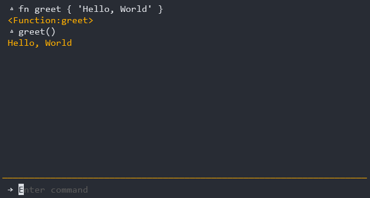

# A SHT language

> **Notice!**
>
> Hey, this is a toy programming language full of bugs and lacking a lot of features. Use it as reference and don't expect performance.

**SHT** is a scripting dynamic programming language, created to learn more about theory and practice of modern languages. Since the main goal is the knowledge, every step, from tokenizer to evaluation, is written manually.

The language is inspired by the cleanness of GO and Python, and by the directness of functional languages, such as Haskell and F#.

# What looks like?

```bash
value := math.fibonacci()
| takeWhile x: x < 4000000
| filter x: x is math.even
| sum
| to Number
```

You can try the SHT REPL tool:



# The CLI

```bash
# Opens the REPL tool
$ sht

# Run a file
$ sht run file.sht

# Run a code string
$ sht exec "print('Hello')"
```

# The Language

## Variables and Types

SHT has dynamic typing without null values.

```go
# Variables are defined using GO syntax
num1 := 1
num2 := 1.5
num3 := 1e100

str1 := 'Hello, World'
str2 := `Hello,
World!`

bool1 := true
bool2 := false

list := List { 1, 2, 3, 4, '🥸' }
dict := Dict { 'a': 1, 'b': 2 }
tuple := (1, 2, 3)

{
  # Every curly braces adds a new scope
  num1 = 3  # overrides the parent num1
  num1 := 3 # defines a new variable for this scope only
}
```

# Operations

```python
# Arithmetic
a + b
a - b
a * b
a / b
a // b  # integer division
a ** b  # pow(aum, b)
a % b   # mod

# Relational
a == b
a != b
a > b
a < b
a >= b
a <= b

# Logical
!a
a and b
a or b

# Other
a .. b # string concat, forces a and b to string convertion
a in b # meta-depending
a is b # meta-depending -- functions implement as `Boolean(b(a))`

```

# Functions

Functions are first classes.

```python
# Returns are optional
fn add(a, b) {
  a + b
}

# Function definitions can be used as expression
sub := fn(a, b) {
  a - b
}

# Function closures
fn mult(x) {
  return fn(a, b) {
    (a + b)*x
  }
}
mult(2)(1, 2) # = 6

# Arrow fuctions works like javascript arrows
say := (x) => { print('say:', x) } 

# Parameter-less functions
fn { ... }

# Default and spreads are allowed, spreads are converted to list
# and default to empty list
fn headTail(head=false, ...body, tail=false) {
  return head, tail
}
headTail(List { 1, 2, 3, 4, 5, 6 }) # = (1, 6)
headTail(List { 1 }) # = (1, false)

# Generator functions returns an iterator, and is only evaluated when
# the iterator is queried
fn oneTwoThree() {
  yield 1
  yield 2
  yield 3
}
oneTwoThree() # = <Iterator>
```

# Error Handling

There is no try catch in the language, instead we use a wrap/unwrap system. When wrapping a value, the expression generates a `Maybe` type, similar to a Monad in other languages. In order to use the value or treat the error, you must unwrap the Maybe and use its value.

```python
fn explode {
  raise 'Error'
}

val := explode()?  # Wrap
type(val) # Maybe

if val! as err { # Unwrap
  ... # Treat error here
}

# Now the variable can assume its real value, in this case, an error
type(val) # Error
```

The expression `val!` returns an `Error` or `false`. In the example above, the if will only be evaluated if val is an error. After unwrapping, the variable will assume its real value.


# Control Flow

If's and for's are similar to Go:

```go
if x > 2 {
  ...
}

if f() as val {
  ...
}

for x < 2 {
  ...
  continue
}

for {
  ...
  break
}
```

Additionally, SHT has match expressions:

```rust
match (n%3, n%5) {
  (0, 0): print('FizzBuzz')
  (0, _): print('Fizz')
  (_, 0): print('Buzz')
  (_, _): print(n)
}
```

and an speciall loop to handle iterators:

```rust
pipe oneTwoThree() as n {
  print(n)
}
# 1
# 2
# 3
```

Speaking of iterators, we have an special syntax to chain iterators, using *pipe functions*:

```f#
oneTwoThree()
| filter x: x%3 == 0 or x%5 == 0
| sum
| to Number
```

# Custom Data Types

SHT does not support OOP, because the language is not so SHTtier:

``` python
data User {
  id = ''    # properties must have default values
  name = ''
  age = 0
  email = ''

  # Instance functions must have the this keyword as first arguments
  fn isAllowed(this) {
    return this.age >= 18
  }

  # If this is not present, the function is static
  fn create() {
    return User()
  }

  # Meta programming! Notice that meta functions are defined using `on`
  on new(this) {
    # similar to a constructor
  }

  on eq(this, other) {
    # a == b
    return this.id == other.id
  }
}

user1 := User.create()
user2 := User { id='x', name='foo' } # id and name default values won't be evaluated.
user3 := User()
user4 := User() { id='y' }
```


All meta functions:

```python
on set(this, property, value)
on get(this, property)
on setItem(this, index, value)
on getItem(this, index)
on new(this)
on call(this, ...)
on number(this)
on boolean(this)
on string(this)
on repr(this)
on to(iterator) # Notice that to is static
on iter(this)
on len(this)
on add(this, other)
on sub(this, other)
on mul(this, other)
on div(this, other)
on intDiv(this, other)
on mod(this, other)
on pow(this, other)
on eq(this, other)
on neq(this, other)
on gt(this, other)
on lt(this, other)
on gte(this, other)
on lte(this, other)
on pos(this)
on neg(this)
on not(this)
on in(this, other)
on is(this, other)
```